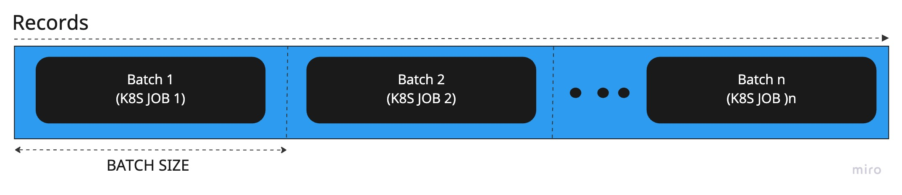

# Db data migration using K8S jobs Helm (Or how I learned to let go & love Helm)

# Abstract
This article will cover the data migration process between two data stores, the evaluation of possible alternatives, and final outcome. We will cover the difference between sequential, asynchronous, multi-threaded, and distributed applications.
And finally, we will overview the practical application of Helm and K8S jobs for data migration tasks.

👉 If you care only about the K8S and Helm stuff, skip to **K8S jobs and Helm
section**. It's ok.
# Introduction

Recently I was working on data migration. We had 2M records in AWS DocumentDb that we wanted to migrate to AWS RDS PostgreSQL; the actual database tech stack is irrelevant as we will not cover the application-level implementation here. 

Long story short, on top of migrating the data from one source to another and adapting record schemas accordingly, it also involved data enrichment and out-of-db context processing, such as re-hosting image links.

First, we took the simplest approach: We created a Python script that migrated one record from DocumentDb to RDS. But soon enough, we realized that:

It takes `~3` seconds to migrate one record, and we have `2M` records. 
So the expected time for complete db migration will be `(2M * 3) / 60 / 60 / 24 = ~69 days`. Well, we don't want to wait `69` days, so we had to come up with something with higher throughput.


In general, I always try to keep things as simple as possible and only introduce complexity when it's needed. A wise man once said, 
> “Premature optimization is the root of all evil. Yet we should not pass 
up our opportunities in that critical 3%.” (Donald E. Knuth).

So we evaluated multiple alternatives.

# Alternatives

## Alternative 1 - Multiple local machines

It might seem like the simplest solution. But it comes with its complexity. If something goes wrong, it will be challenging to understand the cause. Having the application distributed to individual machines means that we don't have aggregated place to look at the logs, execution stats etc. Additionally, we might run into local setup issues, slow networking, ISP issues etc. It will also be quite expensive, as we would pay a significant amount of money for the AWS VPC in/out data.

## Alternative 2 - Asynchronous code

We could take advantage of asynchronous code. Our tasks are not CPU-bound; most of the time is spent on networking requests and db queries. But unfortunately, we used Django for our PostgreSQL db and wanted to reuse the modes. It turns out Django is not that friendly when it comes to async code 😢. Django ORM calls from async code need to be wrapped with `sync_to_async`, which is blocking, so it beats the purpose of asynchronous code.

## Alternative 3 - Multi-Threading
Another valid approach to consider is multi-threading.
Threads can be created based on the number of CPUs. The logic can be described as follows:
```
FOR c in CPUs
  skip = THREAD_NUMBER * BATCH_SIZE
  limit = BATCH_SIZE
  SPAWN thread with batch sized portion of records
JOIN all threads
```
Although it worked, this approach has a couple of disadvantages. First, multi-threading is hard to reason about, debug and observe in a cloud environment. In the cloud, we deal with distributed applications. We already have system components working in parallel and asynchronously; adding concurrency within these components adds another layer of complexity. I kind of reason in big O notation:

> Distributed applications are of complexity `D(n)`, where `n` is the number of components, adding multi-threaded applications will have complexity of `D(n * t)`, where `t` is the number of threads. 

If I had to choose which system to maintain, I would select `D(n)` over `D(n * t)`!
Second, threading creates overhead of synchronization as well as observing the logs and dealing with data becomes much more complicated.
As well as testing, testing is way harder in a multi-threaded environment! And I love testing! So why make my life harder than it should be? The answer might be subjective...

## Alternative 4 - Distributed approach

Similar to the Multi-Threaded approach. But instead of having threads, we have multiple machines working together on the data migration. In this context, we're talking about K8S jobs and pods, but it can be applied to any orchestration tool.

The thinking is similar to multi-threaded:
```
FOR j in JOBs
  skip = JOB_NUMBER * BATCH_SIZE
  limit = BATCH_SIZE
  SPAWN K8S job with batch sized portion of records
WAIT for all created jobs to complete
```

Notice that the number of CPUs no longer limits us; we're limited by the number of jobs we define. I want to emphasize the **WE** in this sentence! It just brings me the nice feeeling of being in control, if im the one defining stuff, I know what to expect! 

This definition/configuration can be infinite(ish). Of course, there's a physical limit to K8S node instances, but that's a threshold way higher than a single-pod CPU limitation. In our micro view from the db migration job, it might feel as infinite as it gets.

## Going with the distributed approach
We went through the approaches and decided to go with the distributed one, as this alternative is simple enough. We have a synchronous Python script ready and tested. We need to multiply it `X` times and assign the data slices to K8S jobs that will run that script.
As a result, we get distributed application that doesn't need synchronization or any operational overhead. Logs are easily accessible, and job resources are visible.

## Batch allocation, or data source slices

As we mentioned above, we will slice the data into chunks and assign it an appropriate K8S job.
This can be illustrated as follows:



So we get the gist - now we need to actually run some math:

### Calculating the number of jobs and the batch size

I'm going to use javascript for that, just because I can?

```javascript

function getMigrationConfig(numberOfRecords, expectedHours){
  const singleRecordMigrationTimeSeconds = 3 
  const overallExecutionSeconds = numberOfRecords * singleRecordMigrationTimeSeconds
  const overallHours = overallExecutionSeconds / 60 / 60
  const workerCount = overallHours / expectedHours
  const batchSize = numberOfRecords / workerCount
  return { workerCount, batchSize }
}
```
So for `2M` records and `1-hour` migration, we get:
```shell
> getMigrationConfig(2000000, 1)
{ workerCount: 1666.6666666666667, batchSize: 1200 }
```

`1666` seems to be a lot of K8S pods; maybe it's okay, maybe not; it really depends on the infrastructure.
How about `5-hour` migration?
```shell
> getMigrationConfig(2000000, 5)
{ workerCount: 333.33333333333337, batchSize: 5999.999999999999 }
```

Well, you get the point. We can choose the configuration we want. The cool thing here is that I'm in control; I can go between `1` and `infinity(ish)`. That wouldn't be possible with threads cause there's way a lower limit on an available number of cores.

This is great 🤩! We went from an initial sequential processing time of `69` days to just under a couple of hours 🚀! It's quite cool, don't you think?

## K8S jobs and Helm
Ok, we got the theory and general understanding of what we want to achieve here. Now we'll get our hands dirty with K8S and Helm.

### What's Helm?

Helm helps you manage Kubernetes applications — Helm Charts help you define, install, and upgrade even the most complex Kubernetes application [1].

In our case, we will use only a subset of its functionality. We're going to define variables and enumeration on the K8S job template.

### Defining our K8S job

Let's start with a simple K8S job [5] definition as if we do not intend to use Helm yet:
> Note: I am using and example docker image - `nginx-helloworld`. This is only for illustration purposes, don't expect it to work out of the box!

```yaml
apiVersion: batch/v1
kind: Job
metadata:
  name: db-migration-job
  namespace: db-migration
spec:
  template:
    spec:
      containers:
      - name: db-migration
        image: nginx-helloworld
        env:
          - name: DB_MIGRATE_JOB_NUMBER
            value: 0
          - name: DB_MIGRATE_BATCH_SIZE
            value: 1000
      restartPolicy: Never
  backoffLimit: 1
```
Pretty standard, we defined a job manifest with a docker image reference and two environment variables: 
`DB_MIGRATE_JOB_NUMBER` and `DB_MIGRATE_BATCH_SIZE`.

So what would we do if we wanted to replicate this definition more than once? We could copy-paste this file multiple times, changing the job and batch variables or some kind of bash scripting.

It's definitely possible, but as one platform engineer I'm working with asked me: 

> What would you choose?


I choose to avoid the crap pill.

Let's see how we'll do it using Helm:
```yaml
{{- range $i, $job := until (.Values.jobsCount | int) }}
apiVersion: batch/v1
kind: Job
metadata:
  name: db-migration-job-{{ $i }}
  namespace: db-migration
spec:
  template:
    spec:
      containers:
      - name: db-migration
        image: nginx-helloworld
        env:
          - name: DB_MIGRATE_JOB_NUMBER
            value: {{ $i | squote }}
          - name: DB_MIGRATE_BATCH_SIZE
            value: {{ $.Values.migrationBatchSize | squote }}
      restartPolicy: Never
  backoffLimit: 1
---
{{ end }}
```

Helm values file content:

```yaml
jobsCount: 2
migrationBatchSize: 100
```

So what have we done here:
1. Range loop at the top. It will create this YAML definition as the number of `jobsCount` in the values file.
2. Added placeholders `DB_MIGRATE_BATCH_SIZE`, and `DB_MIGRATE_JOB_NUMBER` env variables.
3. Dynamically define job name by appending the `{{ i }}` variable

If you dealt with templating engines, I think this should be quite simple to grasp. If not, then welcome to the future!


## Running Helm

First, install Helm if needed, [docs](https://helm.sh/docs/intro/install/).

I have the following directory structure in my example:
```sell
$ tree
├── Chart.yaml         <- Helm chart config
├── templates
│   ├── job.yaml       <- K8S job
│   └── namespace.yaml <- K8S namespace
└── values.yaml        <- template values
```

Where `Chart.yaml`[2] content is simple Helm chart config:
```
apiVersion: v2
name: k8s-job
description: A Helm chart for Kubernetes
type: application
version: 0.1.0
appVersion: "1.16.0"
```
And `templates/namespace.yaml` file:
```
apiVersion: v1
kind: Namespace
metadata:
  name: db-migration
```

Running Helm as:
```shell
λ helm template . --values ./values.yaml 
```
Produces:
```yaml
# Source: k8s-job/templates/job.yaml
apiVersion: batch/v1
kind: Job
metadata:
  name: db-migration-job-0
  namespace: db-migration
spec:
  template:
      containers:
      - name: db-migration
        image: MY_DOCKER_IMAGE
        env:
          - name: DB_MIGRATE_JOB_NUMBER
            value: '0'
          - name: DB_MIGRATE_BATCH_SIZE
            value: '100'
---
# Source: k8s-job/templates/job.yaml
apiVersion: batch/v1
kind: Job
metadata:
  name: db-migration-job-1
  namespace: db-migration
spec:
  template:
      containers:
      - name: db-migration
        image: MY_DOCKER_IMAGE
        env:
          - name: DB_MIGRATE_JOB_NUMBER
            value: '1'
          - name: DB_MIGRATE_BATCH_SIZE
            value: '100'
```

That output can be piped with `kubectl` command and deployed to our K8S cluster:
```shell
$ helm template . --values ./values.yaml | kubectl apply -f -
namespace/db-migration unchanged
job.batch/db-migration-job-0 created
job.batch/db-migration-job-1 created
```
Observer the jobs:
```shell
$ kubectl get jobs -n db-migration
NAME                 COMPLETIONS   DURATION   AGE
db-migration-job-0   0/1           116s       116s
db-migration-job-1   0/1           116s       116s
```

That's it, I hope it helps.

## Things to consider

There are a few things to consider when spawning many K8S pods:

### Cluster nodes scaling
We need to calculate whether our K8S cluster will handle the expected load. In our case defined as AWS node groups [3].

### Ip range
It really depends on the subnet VPC CIDR block [4] configuration. For example, IPv4 CIDR of `172.20.0.0/16` will allow a 65k+ IP range but of course, it also depends on how many IPs are already in use. 

## Summary
We covered the thought process behind the recent data migration I had to do on AWS cloud using K8S jobs and Helm. I think Helm's simplicity and power really shines in this application. 

We haven't covered the application-level logic here as it's peculiar to our case and way beyond the the scope this article.

Hope it helped anyone that has to deal with something similar task!


# References

[1] https://helm.sh/

[2] https://helm.sh/docs/topics/charts/#the-chartyaml-file

[3] https://docs.aws.amazon.com/eks/latest/userguide/managed-node-groups.html

[4] https://docs.aws.amazon.com/vpc/latest/userguide/configure-your-vpc.html#vpc-cidr-blocks

[5] https://kubernetes.io/docs/concepts/workloads/controllers/job
