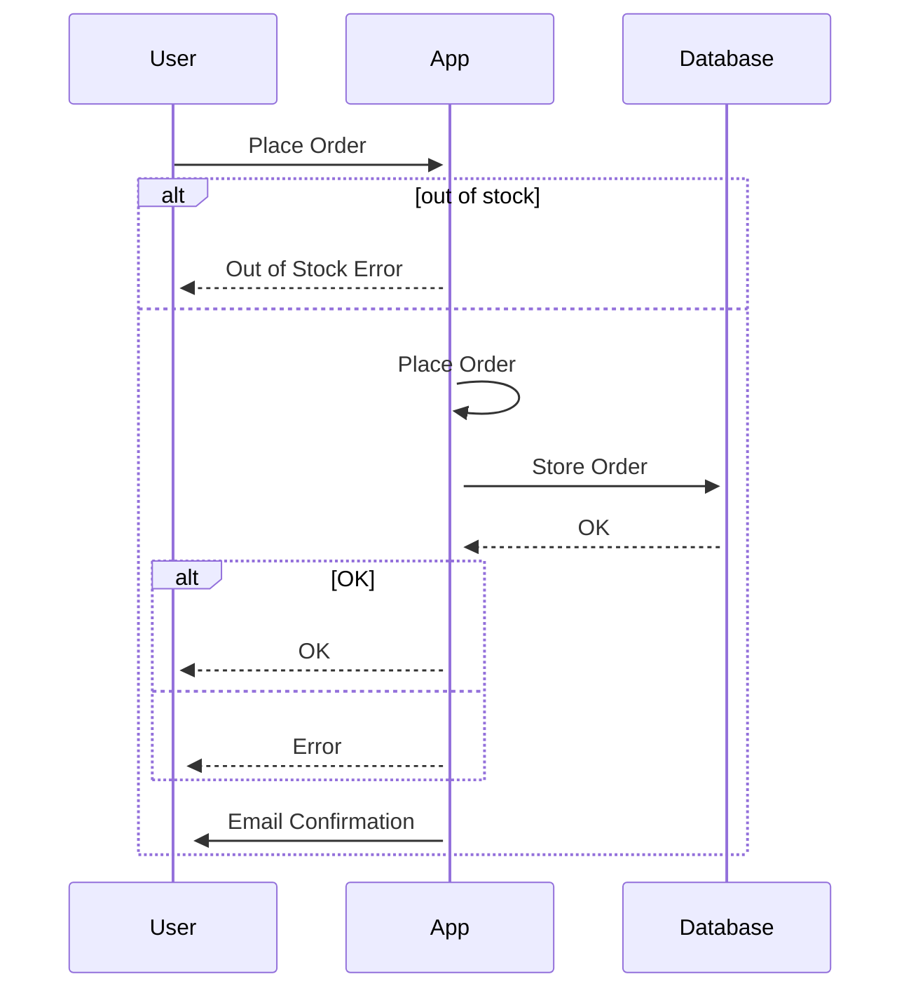

# Hexagonal Architecture (aka Ports And Adapters Architecture) and Its practical application
# Abstract


# Introduction

Hexagonal architecture (HA) (aka ports and adapters architecture), is a software architectural pattern. HA is an alternative to the traditional layered architecture. HA divides a system into several loosely-coupled components, placing the application domain (aka application core) at its center. 

# The problem

The problem with layered architecture is that often we tend to take the separation of layers in such architecture lightly. In layered applications, the domain logic leaks between boundaries. Projects without well-defined domains are hard to reason about and maintain. Additionally, in large projects, the architecture is usually quite complex and it's hard to project it into one-dimensional layer drawings. 

In HA we don't have this dimensional restriction. We have the application on the inside communicating using abstraction over interfaces with the external world. Strict boundaries, abstraction and separation of concerns are
the key here.
## Conceptual difference with layered architecture
Conceptually, there is not much difference between UI, Database, Network or other layers. When we run the same software, in different modes such as Production, Testing etc. We actually want to have the ability to replace the human interacting with our UI with a test suite. Same for the database, sometimes we want to use a real database and sometimes we want to use test in-memory version of it.


# HA components

## Ports
HA components are connected through a Port. Port can be anything that has a functionality contract, but for simplicity, we will stick to interfaces. 

The term “Port" is inspired by the operating system (OS) concepts, where any device that respects the protocol of a port can be connected. For example Universal Serial Bus (USB).

## Adapters
Adapters are the layer between HA components and the outside world. Adapters will implement Port specifications and provide the contract fulfillment. There might be multiple adapters for any one port. 

The Adapter OOP design pattern is one of the well-known design patterns from the "Design Patterns" book. At its core, it "adapts" two objects by converting one interface of a class into another. The HA Adapter pattern is a particular use of this pattern.

## Domain (aka core)
This is the application domain. That's where we keep the business logic. The way I think about it; domain code should be easily explained to a non-technical person. For example, your product manager.
Some do separate the domain and the application, we're going to keep it simple and treat it the same.

## Primary and Secondary
On the architectural level, all ports are similar in HA. However in implementation ports and adapters show up in two flavors: primary (aka driving) and secondary (aka driven).
The difference is simple:
Primary - Actor that drives the application
Secondary - Actor that is driven by the application.
The distinction lies in which component initiates the communication.

## Why is it called Hexoganal? Where is the Hex?

Funny story. Hexagonal might sound like there are 6 components in HA, but we counted only 3! If anything it should've been called Triangular Architecture. The term "Hexagonal" was used not because of the number six significance. The intention was to allow architectural drawings with enough room to insert ports and adapters as needed and not be constrained by a one-dimensional layered drawing.

# HA Key features
## Dependency Inversion (DI)
In HA we have a strong use of interfaces, naturally, it inverts the dependencies. With DI our component dependencies are not dependent on other component implementations, instead, they are dependent upon abstraction.
With DI, we leverage decoupling, modularisation and ease of testing.

“High-level modules should not depend on low-level modules. Both should depend on abstractions. Abstractions should not depend on details. Details should depend on abstractions.” Dependency Injection by Martin Fowler.
## Separation of Concerns 

Our application layers are isolated and have clear responsibilities and definitions.
## Domain-Driven
The application core is agnostic of technologies and infrastructure. It's easier to understand and grasp the business requirements and their changes when the application domain is well-defined and isolated. It can also be built and tested in isolation.


# Practical Application of HA

Let's assume we have a an online shop order application. Without going into too much detail, we can describe the functionality in a sequence diagram:


So how would that might look in HA?
Something like that:


Does it have to be a hexagon-like drawing? Maybe. If you ask me I couldn't care less if it's a hex a circle or a bunch of stars shining on my whiteboard as long as it identifies the application components' boundaries and responsibilities.

I left plenty of space to fill, go crazy.

If we break it down into software components we will have something like that:

```shell
/src
  /domain/ 
    order
  /ports
    email-service-port
    db-service-port
  /adapters
    http-server
    email-service (implements email-service-port)
    email-service-mock (implements email-service-port)
    db-service
    db-service-mock 
```

`http-server` - primary adapter, has reference to the application core`
`http-server-mock` - mock, implements `http-server-port`
`email-service` - secondary adapter, implements `db-service-port`, has no reference to anything in our application.
`email-service-mock` - mock, implements `db-service-port`

Why do you think `http-server` adapter has no port implementation? Well, because it doesn't make sense. `http-server` is the main interface of our application, are we going to reuse its adapter in some way? If you think we should have port here as well, please comment bellow!

### How does core references any adapters?
The application core can reference any adapters, but as we said, not directly. Only through abstraction. One way to achieve that is by using Inversion of Control (IOC) and Dependency Injection (DI). I feel like this is where most of the engineers that are not comfortable with these concepts loose track.
The idea is simple. 
Instead of a core module resolving other modules, i.e knowing exactly where to find DB adapter for example. Instead, it uses interfaces that define the required functionality. But with zero knowledge of the interface implementation. Therefore the interface can be an actual DB integration or a macked instance when used for testing.

Here's an example of a non-IOC code:
file: `order-core.ts`
```TypeScript
export class Db {
  static saveOrder(order: any) {
    console.log("Saving order to db");
    return true
  }
}
```

file `db-adapter.ts`:
```TypeScript
export class Db {
  static saveOrder(order: any) {
    console.log("Saving order to db");
    return true
  }
}
```
and we can use it like that:
```TypeScript
import { Order } from "./order-core";

const order = new Order()

order.placeOrder()
```

In this example. We have stong dependency between Order and Db modules - `Order -> Db`.
Order class references Db class directly, they are tightly coupled, it will be hard to change that integration.

Alternative:

file: `db-port.ts`
```TypeScript
import { OrderPort } from "./db-port";

export class Db implements OrderPort {
  saveOrder(order: any): boolean {
    console.log("Saving order to db");
    return true
  }
}

```

file: `order-core.ts`
```TypeScript
import { OrderPort } from "./db-port"

export class Order {
  constructor(private Db: OrderPort) {
    this.Db = Db
  }

  placeOrder(){
    this.Db.saveOrder({})
  }
}
```

file `db-adapter.ts`:
```TypeScript
import { OrderPort } from "./db-port";

export class Db implements OrderPort {
  saveOrder(order: any): boolean {
    console.log("Saving order to db");
    return true
  }
}
```
and we can use it as follows:
```Typescript
import { Order } from "./order-core";
import { Db } from "./db-adapter";

const order1 = new Order(new Db())
order1.placeOrder()
```

Here we don't have tight coupling between the core component and the adapter. Core knows about the Port interface and that's it! We can now define different behaviors of our Ports, for example:
```Typescript
import { OrderPort } from "./db-port";

export class MockDb implements OrderPort {
  saveOrder(order: any): boolean {
    console.log("You've been mocked!");
    return true
  }
}
```
and use it:
```Typescript
import { Order } from "./order-core";
import { Db } from "./db-adapter";
import { MockDb } from "./db-adapter-mock";

const order1 = new Order(new Db())
order1.placeOrder()

const order2 = new Order(new MockDb())
order2.placeOrder()
```
Boom! Revolutionary. Did your head explode?

This idea is not new, if you remember Liscuv Substitute Principle! If not, have a read.

There are multiple ways of achieving the same thingm most of the post, articles about DI and IOC will be talking about complex configurations, IOC containers, bootstrapping etc. They all have their place and use cases, but we need to remember that the basis is very simple and straight forward.


# Summary
At first, I was thinking of combining a practical example here, but on second thought I thought that would be too much. Maybe I will follow with that. 


# References
[1] https://alistair.cockburn.us/hexagonal-architecture/

[2] http://wiki.c2.com/?HexagonalArchitecture

https://khalilstemmler.com/articles/graphql/graphql-architectural-advantages/

http://wiki.c2.com/?UserInterfaceOutside
