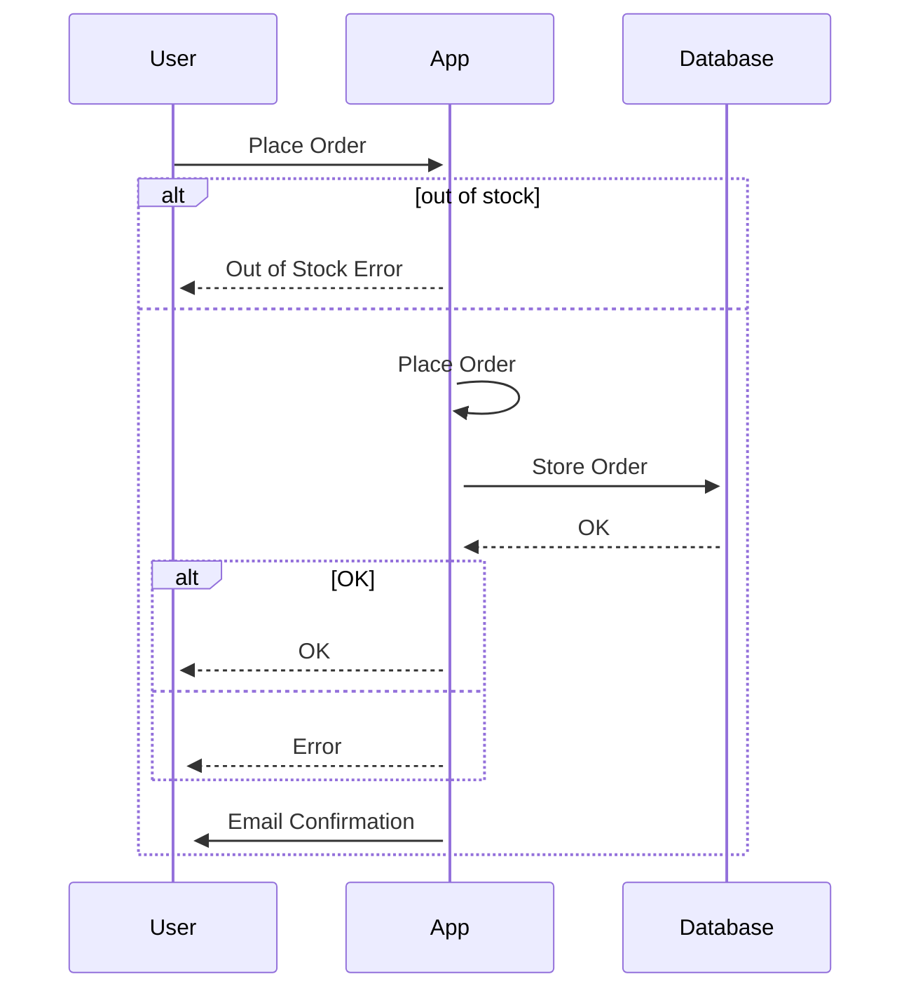
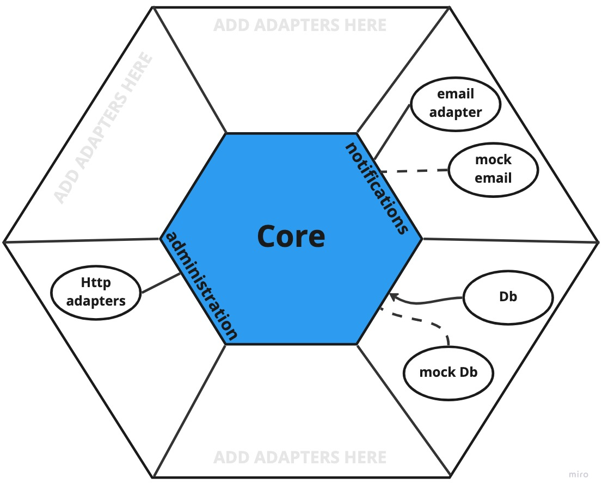
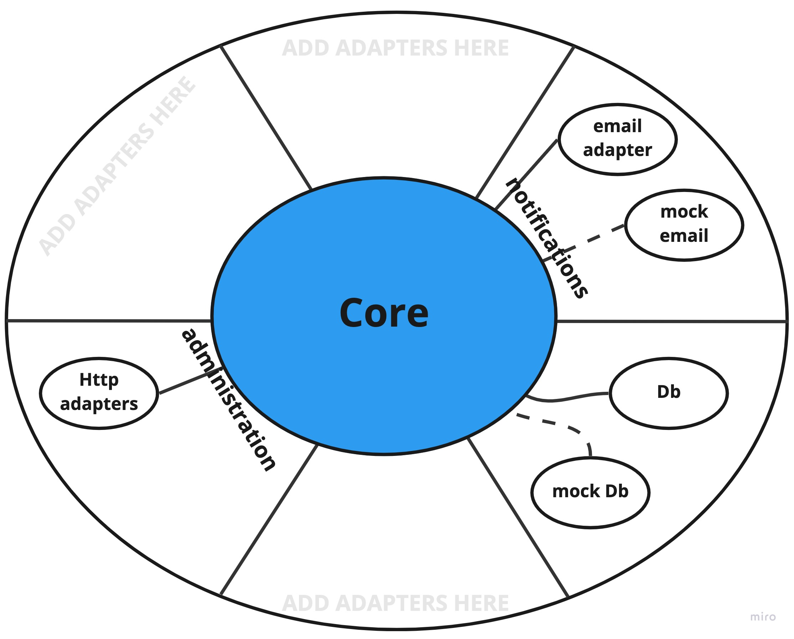

# On Hexagonal Architecture (aka Ports and Adapters), DDD, DI & IOC
# Abstract

In this article, I will overview the concept of **Hexagonal Architecture (HA)**, the problem it addresses, its benefits, implications and some practical examples illustrated via code and diagrams.

There're many sources on this topic. My source is not the most detailed one, but my intention is to simplify the idea as much as I can and break it down to its core concepts and explain its jargon.

# Introduction

**Hexagonal architecture (HA)** aka **Ports** and **Adapters** (P&A), is a software architectural pattern. **HA** is an alternative to traditional [N-Tier architecture](https://en.wikipedia.org/wiki/Multitier_architecture) [1] aka **Layered Architecture.** **HA** divides a system into several loosely-coupled components, placing the application domain, aka application core, at its centre. Usually, this architecture is implemented or referred to within a single project structure, although the same concepts can be applied elsewhere.

# The problem

In 2005, Alistair Cockburn presented **Hexagonal Architecture** as a solution to problems with traditional layering, coupling and entanglement 👉 more [here](https://alistair.cockburn.us/hexagonal-architecture/) [2].

The problem with layered architecture is that we (engineers) tend to take the separation of layers lightly. In layered applications, the domain logic usually "leaks" between layer boundaries.

Projects without well-defined domains are hard to reason about and maintain. Additionally, in practice, the architecture is usually quite complex for large projects, and it's hard to project it into rigid,one-dimensional layer drawings.

In **HA** we don't have this dimensional restriction. We have the application on the inside communicating using abstraction over interfaces with the external world. Strict boundaries, abstraction and separation of concerns are the key here.

## HA vs N-Tier Architecture

Conceptually, our software has little difference between UI, Database, Network or other layers. All these software components can be looked at as "black boxes" that have inputs and outputs. With Layered architectural diagrams, we naturally separate layers by type and not by functionality; UI at the top, Database at the bottom, and we throw something in the middle. 

When we run the same software in different modes, such as Production, Testing etc, we want to have the ability to replace one type of interaction with another; UI with a test suite, Actual Database with an in-memory instance, etc... In other words, we want the same functionality but different implementations. Well, that's what HA is all about ☝️.
# HA components

## Domain

This is the **Core**, the centre, and the meaning of the application. Without it, we will have a bunch of technologies wired together that don't do anything business-related. And although it might sound cool. What's the point?

I like the way my colleague explained it to me once; domain code should be kept isolated, simple and easy to explain to someone non-technical. For example, your product manager or your cat 😻. Some separate the core into domain and application, but we'll keep it simple and treat it as one thing.

## Ports

**HA** components are connected through **Ports**. **Port** can be anything that has a functionality contract, but for simplicity and probably practicality - imagine interfaces.

The term "**Port**" is inspired by the operating system (OS) concepts, where any device that respects the protocol of a port can be connected. For example, Universal Serial Bus (USB) 👉 more on [that](https://alistair.cockburn.us/hexagonal-architecture/)[2].

## Adapters

**Adapters** deal with the outside world. **Adapters** will implement the **Port** contract and provide its fulfillment. There might be multiple adapters for any one port.

The Adapter **OOP** design pattern is one of the well-known design patterns from the classic [Design Patterns](https://www.goodreads.com/book/show/85009.Design_Patterns)[3] book. This pattern "adapts" two objects by converting one class's interface into another. The **HA** adapters are one implementation of this pattern.

### Primary and Secondary

On the architectural level, all ports are equal in **HA**. However, in reality, adapters show up in two flavours: **Primary** and **Secondary**:

**Primary** - Actors that drive the application. UI, HTTP Endpoints, Events etc...

**Secondary** - Actors that are driven by the application. Database, EmailService etc...

This concept is referred to as Left-Right Asymmetry [2]

> The distinction lies in which component initiates the communication.

# Why is it called Hexoganal? Where is the Hex?

A hexagon is a six-sided polygon, so one might think that there are `6` components in **HA**, but we counted only `3` so far 🤔! If anything, it should've been called Triangular Architecture!

According to the author, the term "**Hexagonal**" is used not because of the number `6` significance or the beast 🤘 [2]. It's about aesthetics and convenience. The idea is to allow architectural drawings with enough room to insert both **Ports** and **Adapters** as needed without the constraints of a one-dimensional layered drawing.

# HA features

## Inversion of Control (IoC)

In **HA** we use **Ports**. Naturally, it inverts the dependency direction. With **IoC** our components are not dependent on other component implementations. Instead, they are dependent upon abstraction. We leverage decoupling, modularisation and ease of testing since the implementation of dependent contracts can be changed without affecting the dependent component. Martin Fowler has much more to say about [Inversion of Control](https://martinfowler.com/articles/injection.html)[4].

### Hollywood Principle

Referencing the phrase "don't call us, we'll call you", a common dismissal used in film auditions. The [Hollywood Principle](https://wiki.c2.com/?HollywoodPrinciple)[5] is where components' lifecycle is handled by its context rather than by the object itself. If component **A** uses component **B**, the instance of the **B** will be provided to **A** rather than obtained by **A**.

### Liscuv Substitute Principle

Remember [Liscuv Substitute Principle](https://en.wikipedia.org/wiki/Liskov_substitution_principle) [6]?
Although the Liscuv principle is mainly about types and subtypes' relation, the idea is similar to me 🙂.

## Separation of Concerns

[Separation Of Concerns](http://wiki.c2.com/?SeparationOfConcerns)[8] is about, surprisingly, concerns separation.
The problem is that our concerns are relative, but some concerns are quite obvious. If we have applications with UI concerns and Data persistence concerns, it's kind of obvious that these concerns should be separated.

In **HA**, our application layers are isolated and have clear responsibilities and definitions. The boundaries are connected and communicated through strict interfaces. Therefore it forces us to think about our concerns and their separation.

## Domain-Driven Design (DDD)

The application core is agnostic of technologies, its concern is only the business logic. It's easier to understand and grasp the business requirements and make changes to it when the application domain is well-defined and isolated. It can also be built and tested in isolation. **DDD** is a whole topic of its own.

# Application of HA

Let's assume we have an online shop order API application. Without going into too much detail, we can describe the functionality in a sequence diagram:



So how would that might look in HA?
Something like that:



Does it have to be a hexagon-like drawing? If you ask me I couldn't care less if it's a hex a circle or a bunch of stars shining on my whiteboard as long as it identifies the application components' boundaries and responsibilities.

Let's do the same thing without hexagons (it won't sound as cool, though):



Nothing exotic here, just making a point again about why **HA** is called **HA** 🙃.

Let's break it down into software components:

```shell
  /src
    /core
      order
    /adapters
      http-server
      email
      email-mock
      db
      db-mock
    /ports
      email-port
      db-port
```

**http-server** - primary adapter driving our application.

**email** - secondary adapter, implements **email-port**, has no reference to anything in our application.

**email-mock**- email mock, used for testing, implements **email-port**.

**db** - secondary adapter, implements **db-port**, has no reference to anything in our application.

**db-mock** - db mock, used for testing, implements **db-port**

Have a look at **http-server** adapter. Why it has no port? Well, because it doesn't make sense. We're building a server-side service where **http-server** is the main interface of our application, are we going to reuse its adapter in some way from within our application? It looks like a one-directional communication **http-server** -> **core** to me. Please reach out if you strongly disagree and think we should have a port for it!
## IoC and Loose coupling

The application **Core** can reference any adapters, but as we said, not directly, only through abstraction. One way to achieve that is by using **Inversion of Control (IOC)** and **Dependency Injection (DI)**. The idea is simple - instead of a **Core** module referencing other modules directly, i.e. knowing exactly where to find the **DB** adapter, all it's aware of is its interface. **Core** has zero knowledge of the interface implementation. Therefore the instance behind the interface can be an **SQL DB**, **FileStorage**, or mocked instance.

Here's an example of tightly-coupled code:

```TypeScript
// file: order-core.ts
import { Db } from "./db-adapter"

export class Order {
  private db: Db

  constructor(){
    this.db = new Db()
  }
  
  placeOrder(){
    this.db.saveOrder({})
  }
}
```

```TypeScript
// file: db-adapter.ts
export class Db {
  saveOrder(order: any) {
    console.log("Saving order to db");
    return true
  }
}
```

Our application:

```TypeScript
// file: index.ts
import { Order } from "./order-core";

const order = new Order()

order.placeOrder()
```

In this example, we have a rigid code with a dependency between **Order** and **Db** modules.
**Order** class references **Db** class directly 👉 tightly-coupled components.
The main idea here is that this code will be hard to change. Also, notice that our **Order** class decides how to initialise **Db** class. This sounds like a concern that **Order** class should not have.

Suppose I want to use another **Db** logic such as mocked one I will need to update all its references. We can live with that, but we can do better!

Alternative (with IOC):

```TypeScript
// file: db-adapter.ts
import { DbPort } from "./db-port";

export class Db implements DbPort {
  saveOrder(order: any): boolean {
    console.log("Saving order to db");
    return true
  }
}

```

```TypeScript
// file: order-core.ts
import { DbPort } from "./db-port"

export class Order {
  constructor(private Db: DbPort) {
    this.Db = Db
  }

  placeOrder(){
    this.Db.saveOrder({})
  }
}
```

Our application:

```Typescript
// file: index.ts
import { Order } from "./order-core";
import { Db } from "./db-adapter";

const order1 = new Order(new Db())
order1.placeOrder()
```

Here we don't have tight coupling between the **Core** component and the **Adapter**. **Core** knows about the **Port** interface and that's it! We can now define different behaviours of our Ports!, for example:

```Typescript
import { OrderPort } from "./db-port";

export class MockDb implements OrderPort {
  saveOrder(order: any): boolean {
    console.log("You've been mocked!");
    return true
  }
}
```

Our application:

```Typescript
import { Order } from "./order-core";
import { Db } from "./db-adapter";
import { MockDb } from "./db-adapter-mock";

const prod = new Order(new Db())
prod.placeOrder()

const test = new Order(new MockDb())
test.placeOrder()
```

Boom 🤯! Revolutionary. Did your head explode?
You've just experienced the power of Dependency Injection (DI) and Inversion of Control (IoC) 💪.

With this simple example, we need to configure each object constructor with its dependencies. It might be too much. As with anything, there're multiple ways of achieving the same thing. Most of the material about **DI** and **IoC** will cover more complex configurations such as [IoC Containers](https://wiki.c2.com/?IocContainerComparison)[7]. Such containers might appear overwhelming, but they all have their place and use cases. Remember that it's all based on simple concepts.

## Configuration Management

This might not be 100% on the topic of **HA** and **IoC**, but I think it's important to mention it anyway.
Software misconfiguration is a very common source of bugs. It always happens; using HTTP instead of HTTPS protocol, wrong module import or invalid environment variables. Therefore, it makes sense to keep our configuration isolated in one place. A single place of truth that defines its behaviour. We can also define our **Adaptors** there in **HA**. For example, the configuration of our logger type, whether it will stream the logs to a remote aggregation service or stream it to a local file, should be defined in one place. It will make our life easier when we try to understand what happened to our logs. In contrast, if each module is responsible for its log configuration, we might end up with different parts of our software producing different types of logs - probably a bad idea.

# Summary

We started with **Hexagonal Architecture** and then talked about **N-Tier** architecture and how these two differ. We covered more abstract topics, such as **Separation of Concerns** and **Inversion of Control**, and briefly touched on **Domain-Driven** Design and Application configuration management. With **HA**, we are more flexible in introducing changes. We have defined the application domain and enforce our application's testability.

We started with **Hexagonal Architecture** and then talked about **N-Tier** architecture and how these two differ. We covered more abstract topics, such as **Separation of Concerns** and **Inversion of Control**, and briefly touched on **Domain-Driven** Design and Application configuration management. With **HA**, we are more flexible in introducing changes, we are defining the application domain and enforcing the application's testability.

This write-up was for my own sake of understanding and organising my thoughts as it was about knowledge sharing. I hope it was helpful. If you have any questions/objections/observations/complaints, don't hesitate to reach out!

This write-up was for my own sake of understanding and organising my thoughts as it was about knowledge sharing. I hope it was helpful. If you have any questions/objections/observations/complaints, don't hesitate to reach out!
If you want to learn more; have a look at this [YouTube](https://www.youtube.com/watch?v=th4AgBcrEHA) recording by Alistair Cockburn, the quality is not excellent, but its content is very valuable. And explore the provided references 👇.

# References

[1] https://en.wikipedia.org/wiki/Multitier_architecture

[2] https://alistair.cockburn.us/hexagonal-architecture/

[3] https://www.goodreads.com/book/show/85009.Design_Patterns

[4] https://martinfowler.com/articles/injection.html

[5] https://wiki.c2.com/?HollywoodPrinciple

[6] https://en.wikipedia.org/wiki/Liskov_substitution_principle

[7] https://wiki.c2.com/?IocContainerComparison

[8] http://wiki.c2.com/?SeparationOfConcerns
