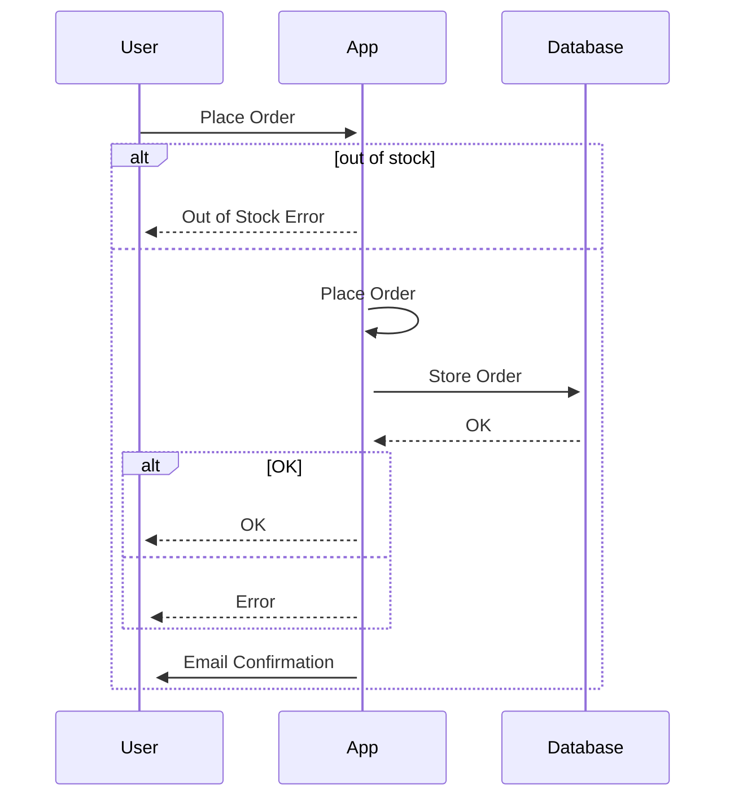

# On Ports And Adapters aka Hexagonal Architecture -  DDD, DI & IOC

# Abstract

In this article, I will overview the concept of Hexagonal Architecture (HA), the problem that it's addressing, its benefits, implications and some practical examples illustrated via diagrams and short code snippets.
There're many sources on this topic. My source is by far not the most elaborative one. I do intend to simplify the idea and break it down to its core concepts as well as its jargon.

# Introduction

Hexagonal architecture (HA) aka Ports and Adapters (P&A), is a software architectural pattern. HA is an alternative to traditional [N-Tier architecture](https://en.wikipedia.org/wiki/Multitier_architecture) [1] aka Layered Architecture. HA divides a system into several loosely-coupled components, placing the application domain aka application core at its center. Usually, this architecture is implemented or referred to within a single project structure, although the same concepts can be applied elsewhere.

# The problem with traditional N-Tier architectures

In 2005, Alistair Cockburn presented Hexagonal Architecture as a solution to problems with traditional layering, coupling and entanglement 👉 more [here](https://alistair.cockburn.us/hexagonal-architecture/) [2].

The problem with layered architecture is that, we (engineers) tend to take the separation of layers lightly. In layered applications, the domain logic usually "leaks" between layer boundaries.
Projects without well-defined domains are hard to reason about and maintain. Additionally, in practice, for large projects, the architecture is usually quite complex and it's hard to project it into rigid one-dimensional layer drawings.

In HA we don't have this dimensional restriction. We have the application on the inside communicating using abstraction over interfaces with the external world. Strict boundaries, abstraction and separation of concerns are the key here.

## HA vs N-Tier - Conceptual difference

Conceptually, there is not much difference between UI, Database, Network or other layers in our software. All these software components can be looked at as "black boxes" that have inputs and outputs. With Layered architectural diagrams, we naturally separate layers by type and not by functionality; UI at the top, Database at the bottom, and we throw something in the middle. Kind of an sh\*\*t sandwich if you ask me 😶.

Additionally, when we run the same software, in different modes such as Production, Testing etc. We want to have the ability to replace one type of interaction with other.UI with a test suite, Actual Database with mocked in memory, etc... In other words, we want the same functionality, but different implementations. Well, that's what HA is all about ☝️.

# HA components


## Domain aka Core

This is the core, the center, and the meaning of the application. Without this, we will have a bunch of technologies wired together that don't do anything business-related. And although it might sound cool. What's the point?
I like the way my colleague explained it to me once; domain code should be kept isolated, simple and easy to explain to someone non-technical. For example, your product manager or your cat. Some do separate the core into domain and application, but we're going to keep it simple and treat it as one thing.

## Ports

HA components are connected through Ports. Port can be anything that has a functionality contract but for simplicity and probably practicality - imagine interfaces.

The term "Port" is inspired by the operating system (OS) concepts, where any device that respects the protocol of a port can be connected. For example Universal Serial Bus (USB) 👉 more on that [here](https://alistair.cockburn.us/hexagonal-architecture/)[2].

## Adapters

Adapters deals with the outside world. Adapters will implement the Port contract and provide its fulfillment. There might be multiple adapters for any one port.

The Adapter OOP design pattern is one of the well-known design patterns from the classic [Design Patterns](https://www.goodreads.com/book/show/85009.Design_Patterns)[3] book. At its core, this pattern "adapts" two objects by converting one interface of a class into another. The HA adapters are one implementation of this pattern.

## Primary and Secondary

On the architectural level, all ports are equal in HA. However, in reality, adapters show up in two flavors: primary (aka driving) and secondary (aka driven):

**Primary** - Actors that drive the application. UI, HTTP Endpoints, Events etc...

**Secondary** - Actors that are driven by the application. Database, EmailService etc...

> The distinction lies in which component initiates the communication.

## Why is it called Hexoganal? Where is the Hex?

Funny story. Hex is `6`, so one might think that there are `6` components in HA, but we counted only `3` 🤔! If anything it should've been called Triangular Architecture!
The term "Hexagonal" is used not because of the number `6` significance or the beast 🤘. 
It's really about aesthetics. HA author wanted to allow architectural drawings with enough room to insert both `Ports` and `Adapters` as needed without constrains of a one-dimensional layered drawing.

# HA Key features

## Inversion of Control (IoC)

In HA we have a strong use of `Ports`, naturally, it inverts the dependency direction. With DI our components are not dependent on other component implementations, instead, they are dependent upon abstraction. With DI, we leverage decoupling, modularisation and ease of testing since the implementation of dependant contracts can be changed without affecting the dependent component. Martin Fowler has much more to say about [Inversion of Control](https://martinfowler.com/articles/injection.html)

This idea is not new, remember [Liscuv Substitute Principle](https://en.wikipedia.org/wiki/Liskov_substitution_principle) [5]! Although Liscuv principle is mainly about types and subtypes' relation, the idea is kind of similar to me 🙂.

## Separation of Concerns

Our application layers are isolated and have clear responsibilities and definitions. The boundaries are connected and communicated through strict interfaces.

## Domain-Driven

The application core is agnostic of technologies used in Adapters and the infrastructure. It's easier to understand and grasp the business requirements and their changes when the application domain is well-defined and isolated. It can also be built and tested in isolation.

# Practical Application of HA

Let's assume we have an online shop order application. Without going into too much detail, we can describe the functionality in a sequence diagram:



So how would that might look in HA?
Something like that:


Does it have to be a hexagon-like drawing? Maybe. If you ask me I couldn't care less if it's a hex a circle or a bunch of stars shining on my whiteboard as long as it identifies the application components' boundaries and responsibilities.

I left plenty of space to fill, go crazy.

If we break it down into software components we will have something like that:

```shell
/src
  /domain/
    order
  /ports
    email-service-port
    db-service-port
  /adapters
    http-server
    email-service (implements email-service-port)
    email-service-mock (implements email-service-port)
    db-service
    db-service-mock
```

`http-server` - primary adapter, has reference to the application core` `http-server-mock`- mock, implements`http-server-port` `email-service`- secondary adapter, implements`db-service-port`, has no reference to anything in our application. `email-service-mock`- mock, implements`db-service-port`

Why do you think `http-server` adapter has no port implementation? Well, because it doesn't make sense. `http-server` is the main interface of our application, are we going to reuse its adapter in some way? If you think we should have port here as well, please comment bellow!

### How does core references any adapters?

The application core can reference any adapters, but as we said, not directly. Only through abstraction. One way to achieve that is by using Inversion of Control (IOC) and Dependency Injection (DI). I feel like this is where most of the engineers that are not comfortable with these concepts loose track.
The idea is simple.
Instead of a core module resolving other modules, i.e knowing exactly where to find DB adapter for example. Instead, it uses interfaces that define the required functionality. But with zero knowledge of the interface implementation. Therefore the interface can be an actual DB integration or a macked instance when used for testing.

Here's an example of a non-IOC code:
file: `order-core.ts`

```TypeScript
export class Db {
  static saveOrder(order: any) {
    console.log("Saving order to db");
    return true
  }
}
```

file `db-adapter.ts`:

```TypeScript
export class Db {
  static saveOrder(order: any) {
    console.log("Saving order to db");
    return true
  }
}
```

and we can use it like that:

```TypeScript
import { Order } from "./order-core";

const order = new Order()

order.placeOrder()
```

In this example. We have stong dependency between Order and Db modules - `Order -> Db`.
Order class references Db class directly, they are tightly coupled, it will be hard to change that integration.

Alternative:

file: `db-port.ts`

```TypeScript
import { OrderPort } from "./db-port";

export class Db implements OrderPort {
  saveOrder(order: any): boolean {
    console.log("Saving order to db");
    return true
  }
}

```

file: `order-core.ts`

```TypeScript
import { OrderPort } from "./db-port"

export class Order {
  constructor(private Db: OrderPort) {
    this.Db = Db
  }

  placeOrder(){
    this.Db.saveOrder({})
  }
}
```

file `db-adapter.ts`:

```TypeScript
import { OrderPort } from "./db-port";

export class Db implements OrderPort {
  saveOrder(order: any): boolean {
    console.log("Saving order to db");
    return true
  }
}
```

and we can use it as follows:

```Typescript
import { Order } from "./order-core";
import { Db } from "./db-adapter";

const order1 = new Order(new Db())
order1.placeOrder()
```

Here we don't have tight coupling between the core component and the adapter. Core knows about the Port interface and that's it! We can now define different behaviors of our Ports, for example:

```Typescript
import { OrderPort } from "./db-port";

export class MockDb implements OrderPort {
  saveOrder(order: any): boolean {
    console.log("You've been mocked!");
    return true
  }
}
```

and use it:

```Typescript
import { Order } from "./order-core";
import { Db } from "./db-adapter";
import { MockDb } from "./db-adapter-mock";

const order1 = new Order(new Db())
order1.placeOrder()

const order2 = new Order(new MockDb())
order2.placeOrder()
```

Boom! Revolutionary. Did your head explode?


There are multiple ways of achieving the same thingm most of the post, articles about DI and IOC will be talking about complex configurations, IOC containers, bootstrapping etc. They all have their place and use cases, but we need to remember that the basis is very simple and straight forward.

# Summary

At first, I was thinking of combining a practical example here, but on second thought I thought that would be too much. Maybe I will follow with that.

# References

[1] https://en.wikipedia.org/wiki/Multitier_architecture

[2] https://alistair.cockburn.us/hexagonal-architecture/

[3] https://www.goodreads.com/book/show/85009.Design_Patterns

[4] https://martinfowler.com/articles/injection.html

[5] https://en.wikipedia.org/wiki/Liskov_substitution_principle

[2] http://wiki.c2.com/?HexagonalArchitecture

https://khalilstemmler.com/articles/graphql/graphql-architectural-advantages/

http://wiki.c2.com/?UserInterfaceOutside
