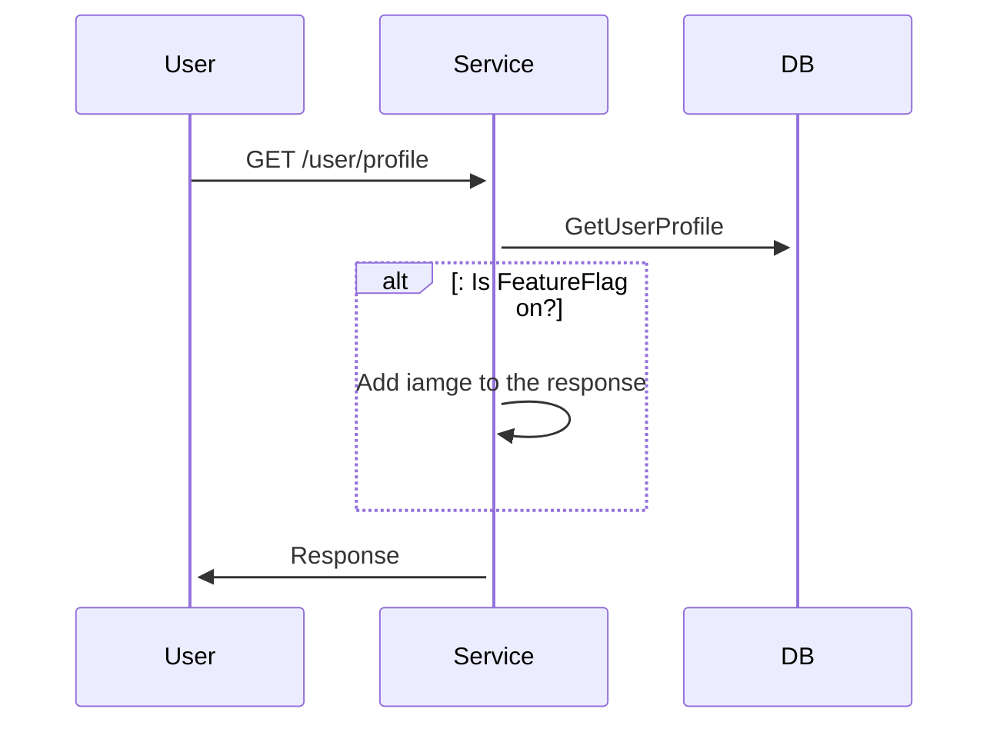
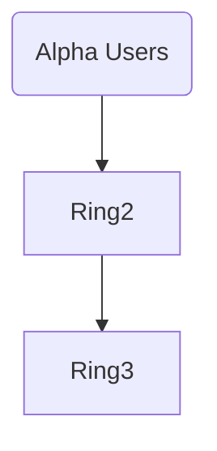
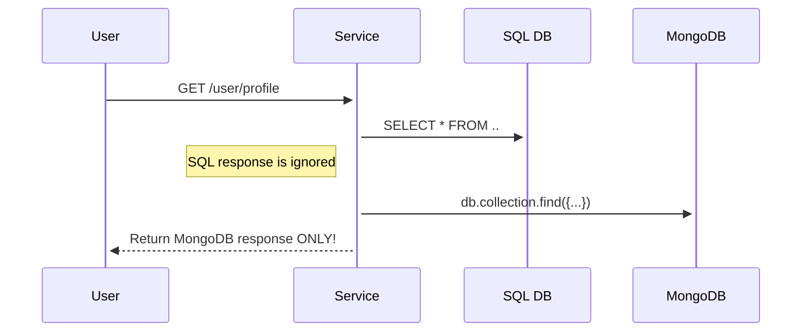

# Progressive Delivery
# Abstract

In this article, we will cover multiple **Progressive Delivery** techniques with high-level illustrations and a general concept review.

# Introduction

**Continuous Delivery (CD)** keeps our code constantly in a deployable state. Using **CD** we can release faster with higher frequency.
That's all great fun, but we can do better! With traditional delivery, when a new version is deployed - the old version is replaced with a new one, meaning that all of our users are immediately affected by the release. **Progressive Delivery** offers techniques for deploying applications gradually while minimising impact and downtime. 

Before jumping into **Progressive Delivery**, we should ensure that we have a firm grasp of Agile, CI/CD, and DevOps practices. **Progressive Delivery** includes more advanced software development practices and infrastructure management.

There are several delivery strategies; here, we're going to cover the following:
- Feature Flags 
- A/B Testing 
- Ring Deployment
- Dark Launching
- Blue/Green Deployments
- Canary Deployments

# Feature Flags

The idea behind **Feature Flags (FF)** is quite simple: We add logical branches to our code - `if/else` statements and control them via configuration. This can be achieved using one of the managed services, such as [Unleash](https://www.getunleash.io/)[1] or [LaunchDarkly](https://launchdarkly.com/)[2]. These services require some additional configuration and might be costly. But a similar idea can be achieved with anything that manages configuration remotely, a versioned JSON file for example (very inflexible but still doable).

Feature flag integration can be illustrated as follows:

In this example, depending on whether the `FLAG` is `ON` or `OFF` we will add additional data to the response. 
**Feature Flags** are **Progressive Delivery** basics - it's the first step towards minimising deployment risk.
It allows us to test in production, a powerful ability because test environments never represent production 100%!

**Feature Flags** don't involve any infrastructural changes, only application code and configuration management integration.

**Feature Flags** allow us to get **immediate feedback** for our changes functionality. And if something goes wrong, we can turn `OFF` the `FLAG` instead of rolling back the whole deployment. And guess what? We can turn it `ON`/`OFF` as many times as we like! Pretty cool concept 🤓!

Some call it "zero-risk" deployments. But I would avoid claiming that. If not managed carefully; it might have a big negative impact as well. Generally, **Feature Flags** should be short-lived to avoid confusion. If you don't need the **Feature Flag** anymore - delete it.

As always, all this goodness comes with additional complexity. Once our application has feature flags integration, we need to be confident in multiple flows and maintain more tests 💪.

# A/B Testing

[**A/B Testing**](https://www.optimizely.com/optimization-glossary/ab-testing/)[3], aka bucket testing, aka split-run testing, is a user-experience research methodology [4]. **A/B Testing** can be thought of as an extension of **Feature Flags**. It allows us to test features on different user audiences, monitor the experience and potentially come to conclusions about what works and what does not. 

For example, if we have two designs of a button, one is `Purple`, and the other is `Gray`, and we want to experiment to understand which one is better suited for our application - we can redirect 50% of users to the `Purple` button and the other half to the `Gray` one and analyse the engagement stats to make a decision. The same thing can be done with demographics-based or geo-location-based logic.

If you're familiar with **Blue/Green Deployments**, **A/B Testing** might look the same at first glance🤔. But it's quite different. **A/B Testing** is behaviour-monitoring paradigm. **Blue/Green Deployments** is an engineering practice. They can be used both together and in segregation.

# Ring Deployment

With [**Ring Deployment**](https://learn.microsoft.com/en-us/azure/devops/migrate/phase-rollout-with-rings?view=azure-devops)[8], we can gradually deploy, validate and monitor deployment impact while limiting the effect on the end users.

Rings illustration:



With **Ring Deployment** we can choose to release first to our alpha users. Afterward, we can move on to the next ring which will include our exteranl beta users and so on and so forth. The impact also called **Blast Radius** will increase as the changes propagate through the defined rings. Can be used together with **Feature Flags** technique to control the features.

# Dark Launching

With [Dark Launching](https://martinfowler.com/bliki/DarkLaunching.html)[7] we deploy back-end changes without affecting the users with the new behaviour. This deployment method allows for the assessment of performance impacts on the system before publically announcing the new capability.

Using **Dark Launching**, we can run different feature implementations in parallel and analyse the impact while returning only a single response to the user.

Illustration:



In this example, we're fetching data from both data sources - SQL and MongoDB. However, we're returning only the MongoDb data to the end user.

This method is powerful for testing system load and resiliency - user interaction enhancement. As always, can be applied with  **Feature Flags** to control that darkness 🧛.

# Blue/Green Deployments

[Blue/Green Deployments](https://docs.cloudfoundry.org/devguide/deploy-apps/blue-green.html)[5] is a deployment method where the new version is launched side by side with the old version. Both old and new versions co-exist during the deployment. It's one of the simplest ways to minimise deployment downtime on the infrastructure level. This method can be used in various applications, Virtual Machines (VMs), Containers and Kubernetes clusters.

Blue/Green deployment phases:

```mermaid
flowchart TB
    subgraph V2 Traffic
        U3[Users] -->|Traffic| L3(Load Balancer)
        L3 ~~~  APP3_V1[App v1]
        L3 == Route  ==> APP3_V2[App v2]
        style APP3_V2 fill:#008f00
        style APP3_V1 fill:#000099
    end
    subgraph V1 Traffic, V2 deployed

        U2[Users] -->|Traffic| L2(Load Balancer)
        L2 == Route  ==> APP2_V1[App v1]
        L2 ~~~ APP2_V2[App v2]
        style APP2_V2 fill:#008f00
        style APP2_V1 fill:#000099
    end

    subgraph V1 deployed
        U[Users] -->|Traffic| L(Load Balancer)
        L == Route  ==> APP1_V1[App v1]
        style APP1_V1 fill:#000099
    end
```

Step 1. All users are routed to the current version (V1) - Blue deployment

Step 2. A new version (V2) is deployed - Green deployment. This version has 0 live trafic from the load balancer.

Step 3. Engineers can internally test the V2 version. If concluded as valid, traffic is switched to that new version.

Step 4. If all is good, the old version is discarded. It might vary - some prefer to always keep the last deployment.

The benefit here is that we can test new versions in Production before affecting our customers, and in case we do release, we can switch back to the previous version if needed. The load balancer switch is way faster than redeploying a new version!


# Canary Deployments

A [Canary Deployment](https://martinfowler.com/bliki/CanaryRelease.html) [6] is a deployment when only a subset of users get access to the new version of the application

Why are they called Canary? Glad you asked. Coal miners carried real canary birds along them to find gas leaks. These birds are more sensitive than humans to odourless fumes; when they checked out, it was time to get out of the mine. Sad but true story.

Blue/Green deployments minimize deployment downtime, but it's not perfect. If the deployment has an issue that is evident only after some time or with increasing load - 
then all users end up being affected since the traffic switch is all or nothing.

Canary improves Blue/Green deployments; instead of switching 100% of traffic all at once to the new version, we can move only a subset of users over time.

Canary illustration:
```mermaid
flowchart TB
    subgraph V2 Traffic
        U3[Users] -->|Traffic| L3(Load Balancer)
        L3 ~~~ APP3_V1[App v1]
        L3 == 100%  ==> APP3_V2[App v2]
        style APP3_V2 fill:#008f00
        style APP3_V1 fill:#000099
    end
    subgraph V1+V2 Traffic, V2 deployed

        U2[Users] -->|Traffic| L2(Load Balancer)
        L2 == 80%  ==> APP2_V1[App v1]
        L2 == 20%  ==> APP2_V2[App v2]
        style APP2_V2 fill:#008f00
        style APP2_V1 fill:#000099
    end

    subgraph V1 Traffic
        U[Users] -->|Traffic| L(Load Balancer)
        L ==  100%  ==> APP1_V1[App v1]
        style APP1_V1 fill:#000099
    end
```

Step 1. All users are routed to the current version (V1) - Blue deployment.

Step 2. A new version has been deployed. This version gets only a fraction of the traffic, for example, 20%.

Step 3. We can monitor the deployment and decide whether we're confident at this stage. If we are, we can increase the traffic.

Step 4. If all is good, eventually, 100% of traffic will be redirected the new version.


The exact configuration of traffic percentage is configurable and time frames, and the whole process can be set as manual and automated.


Canary deployments are more complicated to set up than Blue/Green deployments. The load balancer here has more functionality than we have with Blue/Green deployments.

There are also cost implications since side-by-side deployments cost is higher as we need extra infrastructure. 

Handling databases can be tricky when it comes to schema changes. 
The problem is the database must simultaneously work with the canary and the control versions during the deployment. So, if we have breaking schema changes, we’re in trouble. We need to maintain backward compatibility as we make changes, which adds another layer of complexity.


# Summary

TODO: 

# References
[1] https://www.getunleash.io/

[2] https://launchdarkly.com/

[3] https://www.optimizely.com/optimization-glossary/ab-testing/)

[4] https://quod.lib.umich.edu/w/weave/12535642.0001.101?view=text;rgn=main

[5] [Blue/Green Deployments](https://docs.cloudfoundry.org/devguide/deploy-apps/blue-green.html)

[6] https://martinfowler.com/bliki/CanaryRelease.html

[7] https://martinfowler.com/bliki/DarkLaunching.html

[8] https://learn.microsoft.com/en-us/azure/devops/migrate/phase-rollout-with-rings?view=azure-devops
