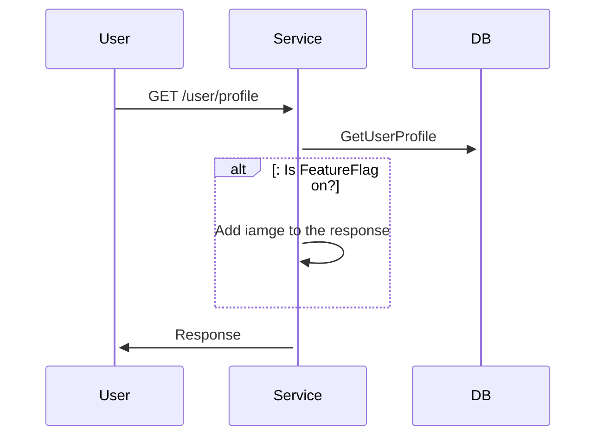
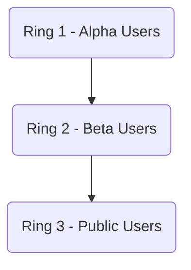
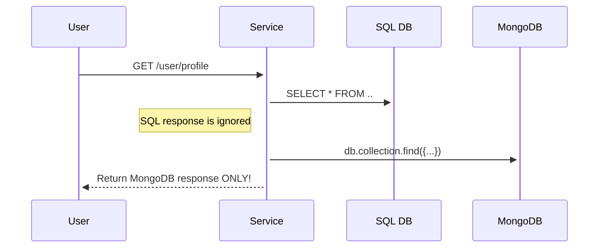

# Progressive Delivery

# Abstract

This article will cover **Progressive Delivery** techniques such as **Feature Flags**, **A/B Testing**, **Ring Deployment**, **Dark Launching**, **Blue/Green** and **Canary** deployments with high-level illustrations and a general concept overview.

# Introduction

**Continuous Delivery (CD)** practice ensures that our code is constantly in a deployable state. Using **CD**, we can release faster with higher frequency.
That's all great fun, but we can do better! When a new version is deployed in the traditional delivery manner - the old version is replaced with a new one, meaning that all of our users are immediately affected by the new release. **Progressive Delivery** offers techniques for deploying applications gradually over time while minimising deployment downtime.

Before jumping into **Progressive Delivery** implementation, we should ensure that we have a firm grasp of Agile, CI/CD, and DevOps practices, as **Progressive Delivery** includes more advanced software development practices and infrastructure management.

# Feature Flags

The idea behind **Feature Flags (FF)** is quite simple: We add logical branches to our code - `if/else` statements and control them via configuration. This can be achieved using one of the SaaS (Software as a Service) platforms, such as [Unleash](https://www.getunleash.io/)[1] or [LaunchDarkly](https://launchdarkly.com/)[2] for configuration management. These services require additional integration and might be costly, but they offer support and a range of features. But a similar idea can be achieved with any remotely managed configuration, a versioned JSON file, for example.

Application using \**Feature Flag*s\* can be illustrated as follows:



In this example, depending on whether the `FLAG` is `ON` or `OFF` we will add additional data to the response.
**Feature Flags** are **Progressive Delivery** basics - it's the first step towards minimising deployment risk.
It allows us to test in production, a powerful ability because test environments never represent production 100%!

**Feature Flags** don't involve any infrastructural changes, only application code and configuration management integration.

**Feature Flags** allow us to get **immediate feedback** for our changes functionality. And if something goes wrong, we can turn `OFF` the `FLAG` instead of rolling back the whole deployment. And guess what? We can turn it `ON`/`OFF` as many times as we like! Pretty cool concept 🤓!

Some call it "zero-risk" deployments. But I would avoid claiming that. If not managed carefully, it might also have a significant negative impact. Generally, **Feature Flags** should be short-lived to avoid confusion. If you don't need the **Feature Flag** anymore - delete it.

As always, all this goodness comes with additional complexity. Once our application has feature flags integration, we need to be confident in multiple flows and maintain more tests 😶.

# A/B Testing

[**A/B Testing**](https://www.optimizely.com/optimization-glossary/ab-testing/)[3], aka bucket testing, aka split-run testing, is a user-experience research methodology [4]. **A/B Testing** can be thought of as an extension of **Feature Flags**. It allows us to experiment with features on different user audiences, monitor the behaviour, and conclude what works and does not.

For example, if we have two designs of a button, one is `Purple`, and the other is `Gray`, and we want to experiment to understand which one is better suited for our application - we can redirect 50% of users to the `Purple` button and the other half to the `Gray` one and analyse the engagement stats to make a decision. The same thing can be done with demographics-based or geo-location-based logic.

```mermiad
graph TD
    A[User Base] -->|A - 50% Presented with| V1[V1]
    A[User Base] -->|B - 50% Presented with| V2[V2]
    V2-->|Genererate| S2[20% sales]
    V1-->|Genererate| S1[80% sales]
    S1-->END
    S2-->END[V1 won A/B test!]
```

If you're familiar with **Blue/Green Deployments**, **A/B Testing** might look the same at first glance🤔. But it's quite different. **A/B Testing** is behaviour-monitoring paradigm. **Blue/Green Deployments** is an engineering practice. They can be used both together and in segregation.

# Ring Deployment

With [**Ring Deployment**](https://learn.microsoft.com/en-us/azure/devops/migrate/phase-rollout-with-rings?view=azure-devops)[8], we can gradually deploy, validate and monitor deployment impact while limiting the effect on the end users.

Deployment rings:



With **Ring Deployment**, we can choose to release first to our alpha users. Afterwards, we can move on to the next ring, which will include our external beta users and so on and so forth. The impact, also referenced as **Blast Radius**, will increase as the software release propagate through the defined rings.

# Dark Launching

With [Dark Launching](https://martinfowler.com/bliki/DarkLaunching.html)[7], we deploy back-end changes without affecting the end users with the new behaviour. This deployment method allows for assessing system performance and load impacts on the system before publicly releasing the new version.

Using **Dark Launching**, we can run different feature implementations in parallel and analyse the impact while returning only a single response to the user.

**Dark Launching** in its all glory:



In this example, we're fetching data from both data sources - SQL and MongoDB. However, we're returning only the MongoDb data to the end user.

This method is robust for testing system load and the system's resiliency. Especially beneficial when testing user interaction enhancement changes. As anything, it can be applied with **Feature Flags** to control the darkness 🧛.

# Blue/Green Deployments

[Blue/Green Deployments](https://docs.cloudfoundry.org/devguide/deploy-apps/blue-green.html)[5] is a deployment method where the new version is launched side-by-side with the old version - both versions co-exist during the deployment. It's one of the simplest ways to minimise deployment downtime on the infrastructure level. This method can be used in various applications such as **Virtual Machines**, **Containers** and **Kubernetes** clusters.

Blue/Green deployment steps:

```mermaid
flowchart TB
    subgraph V2 Active
        direction TB
        U3[Users] -->|Traffic| L3(Load Balancer)

        L3 ~~~  APP3_V1[App v1]
        L3 == Route  ==> APP3_V2[App v2]
        style APP3_V2 fill:#008f00
        style APP3_V1 fill:#000099
    end
    subgraph V1 Active, V2 Deployed
        direction TB
        U2[Users] -->|Traffic| L2(Load Balancer)
        L2 == Route  ==> APP2_V1[App v1]
        L2 ~~~ APP2_V2[App v2]
        style APP2_V2 fill:#008f00
        style APP2_V1 fill:#000099
    end
    subgraph V1 Active
        direction TB
        U[Users] -->|Traffic| L(Load Balancer)
        L == Route  ==> APP1_V1[App v1]
        style APP1_V1 fill:#000099
    end
```

1. All users' traffic is routed to V1 (Blue deployment)

2. V2 is deployed (Green deployment). This version has no traffic routed from the load balancer.

3. V2 internal tests are performed. If tests pass 1. traffic is routed to V2.

4. If all is good, the old version is discarded.

> The actual strategy and steps might vary - some prefer to keep the last deployment or even further history of deployments.

The main benefit is that we can test release candidates in a production environment before affecting our users. If we decide to release the new version and find issues only after a while, we can quickly switch back. The load balancer switch is way faster than redeploying a new version! Therefore minimising the impact.

# Canary Deployments

A [Canary Deployment](https://martinfowler.com/bliki/CanaryRelease.html) [6] is a deployment when only a subset of users get access to the new version of the application.

Why are they called **Canary Deployments**? Glad you asked. 

> Dating back to 1900, coal miners used canaries to detect carbon monoxide and other toxic gases before they hurt humans. Sad but true story.

**Blue/Green Deployments** minimise deployment downtime, but it's not perfect. If the deployment has an issue that is evident only after some time or with increasing load - 
then all users end up being affected since the traffic switch is all or nothing.

**Canary** improve on **Blue/Green Deployments**. Instead of switching `100%` of traffic all at once to the new version, we redirect only a subset of users over time.

Canary illustration:

```mermaid
  flowchart TB
      subgraph V2 Active
          direction TB
          U3[Users] -->|Traffic| L3(Load Balancer)
          L3 ~~~ APP3_V1[App v1]
          L3 == 100%  ==> APP3_V2[App v2]
          style APP3_V2 fill:#008f00
          style APP3_V1 fill:#000099
      end
      subgraph V1+V2 Active, V2 Deployed
          direction TB
          U2[Users] -->|Traffic| L2(Load Balancer)
          L2 == 80%  ==> APP2_V1[App v1]
          L2 == 20%  ==> APP2_V2[App v2]
          style APP2_V2 fill:#008f00
          style APP2_V1 fill:#000099
      end

      subgraph V1 Active
          direction TB
          U[Users] -->|Traffic| L(Load Balancer)
          L ==  100%  ==> APP1_V1[App v1]
          style APP1_V1 fill:#000099
      end
```

1.  V1 is the current version (Blue deployment).

2. V2 has been deployed. V2 gets only a fraction of the traffic, for example, 20%.

3. Deployment is monitored. If all is good, we will increase the traffic to V2.

4. Eventually, `100%` traffic is redirected to the new version.

The exact configuration of traffic percentage and time frames are configurable, and the whole process can be manual or automated.

Canary deployments are more complicated than **Blue/Green Deployments** on the infrastructure level. The load balancer here has to be "smarter", as it needs to understand how to route portions of the traffic towards configurable destinations.

There are also cost implications to this approach - side-by-side deployments cost is higher than traditional deployments as we need extra infrastructure at the deployment time.

Handling databases can be tricky when it comes to schema changes. The problem is that databases must simultaneously work with multiple application versions during deployment. So, for example, if we have breaking schema changes, we’re in trouble. We need to maintain backward and forward compatibility as we make changes, which adds another layer of complexity to software development and maintenance.
# Summary

We covered quite a few deployment strategies 😅. They all have their place and use cases, some more complex than others. Some include the need for "smart" networking such as load balancer, and even service mesh, while others are strictly application-level. 

These techniques can be combined together **Feature Flags** with **Canary Deployment**, **Feature Flags** and **Dark Launching**, **Canary** and **Ring Deployments**, and the list go on. 

The more "stuff" we include in our software, the more complexity we'll have and that's ok if it's needed, but if it isn't, then why bother?

If you are lost and don't know where to start, I would suggest starting from the basics - **CI/CD** and DevOps practices.

For further reading, I suggest 👉 [Continuous Delivery: Reliable Software Releases Through Build, Test, and Deployment Automation](https://www.goodreads.com/book/show/8686650-continuous-delivery?ac=1&from_search=true&qid=YgDjkA3y3F&rank=1)

This write-up was for my own sake of understanding and the organisation of my thoughts as it was about knowledge sharing. 

I hope it was useful!

# References

[1] https://www.getunleash.io/

[2] https://launchdarkly.com/

[3] https://www.optimizely.com/optimization-glossary/ab-testing/)

[4] https://quod.lib.umich.edu/w/weave/12535642.0001.101?view=text;rgn=main

[5] [Blue/Green Deployments](https://docs.cloudfoundry.org/devguide/deploy-apps/blue-green.html)

[6] https://martinfowler.com/bliki/CanaryRelease.html

[7] https://martinfowler.com/bliki/DarkLaunching.html

[8] https://learn.microsoft.com/en-us/azure/devops/migrate/phase-rollout-with-rings?view=azure-devops
