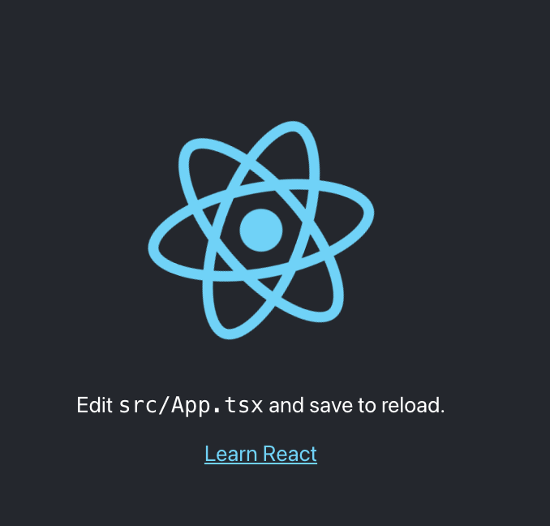

# React app in 6 steps (without HTTP server)
This short article will demonstrate how I built a "Hello World" React application-based website, without serving it from an HTTP server. Nothing fancy; I just thought it might be helpful for someone with the same issues as me. 
I found the documentation a bit off. I mean, it's there, if you know where to look 👀.

I will use yarn as my package manager, just cause I like it, but similar (even almost identical) can be achieved using npm.

Ok, let's go :)


## Step 1. Install  create-react-app

```shell
$ yarn global add create-react-app
```
It will install the `create-react-app` package globally on our machine, which means it will be accessible from every terminal [1].

## Step 2. Create React app

```shell
$ create-react-app me --template typescript
```
This command will create the "Hello World" project with the TypeScript template. Why TypeScript? Why not? I love it!


## Step 3. Install dependencies

Go into the generated folder (in our case, `me`) and install all the dependencies of the project:

```shell
$ cd me && yarn
```

Should get a file structure similar to this:

```shell
→ ls -la
total 3144
-rw-r--r--   ... .gitignore
-rw-r--r--   ... README.md
drwxr-xr-x   ... build
drwxr-xr-x   ... node_modules
-rw-r--r--   ... package-lock.json
-rw-r--r--   ... package.json
drwxr-xr-x   ... public
drwxr-xr-x   ... src
-rw-r--r--   ... tsconfig.json
-rw-r--r--   ... yarn.lock
```

## Step 4. Build your app
Build script creates a build directory with a production build of your app.

```shell
$ yarn build
```

This should result in similar to the following:

```shell
→ ls -l ./build/
total 80
-rw-r--r-- ... .gitignore
-rw-r--r-- ... README.md
drwxr-xr-x ... build
drwxr-xr-x ... node_modules
-rw-r--r-- ... package-lock.json
-rw-r--r-- ... package.json
drwxr-xr-x ... public
drwxr-xr-x ... src
-rw-r--r-- ... tsconfig.json
-rw-r--r-- ... yarn.lock
```


## Step 5. Launch our static website in the browser and fail

Navigate to your file in your browser. 
You can type the path to your file in the search bar something like:
```shell
file:///<YOUR MACHINE PATH HERE>/build/index.html
```
Or just drag and drop it into a new tab. Anything that works for you.

Now observe. It's empty. Simplistic. Minimal. Beautiful. But not quite what you wanted, innit?

The problem is that our react app is built to be served by a server. 

Open up the console and observe the error logs:


## Step 6. Find solutions to our problems!

Have no fear! The documentation is here! [2]

If you read the docs, its sates:
```text
....set up your favorite HTTP server ...
```
But... I don't want to set up my FAVOURITE HTTP server. I'm not even sure I have one...

If you look further down you will see a section called **Building for Relative Paths** [3].

That's what we need!

Let's set `"homepage": "./",` in your package JSON:

```json
{
  "name": "me",
  "version": "0.1.0",
  "private": true,
 ...
  "homepage":".", <---ADD THIS
 ...
```
Build the app again. Open`index.html` again. And you should get the spinning React logo :)



That's it!

## References

[1] https://classic.yarnpkg.com/lang/en/docs/cli/global/

[2] https://create-react-app.dev/docs/deployment/

[3] https://create-react-app.dev/docs/deployment/#building-for-relative-paths

